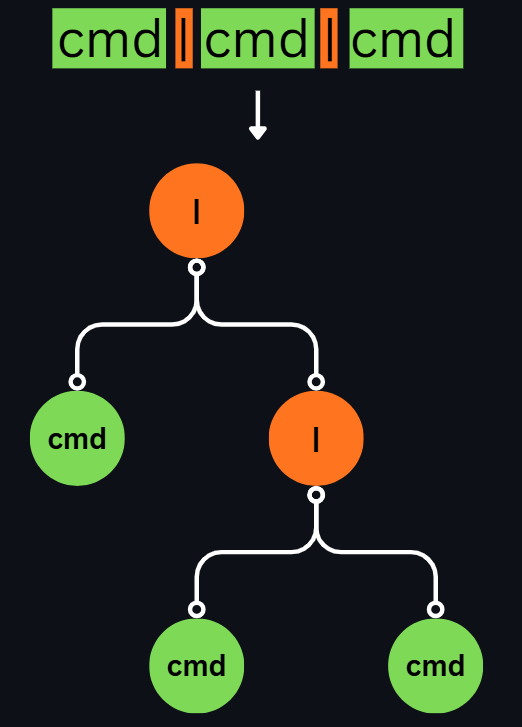
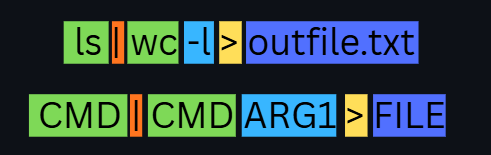
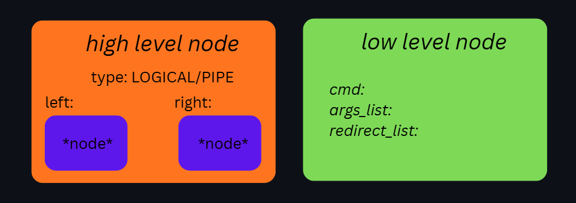
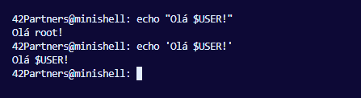
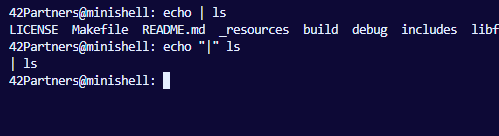

# Minishell

Feito por :
* [gustaoli](https://github.com/Gus1331)
* [rafaoliv](https://github.com/devrafaelly)

# Resumo
O minishell é um projeto do currículo da 42 de grande importância, sendo considerado um dos mais desafiadores do common-core. Criamos nosso próprio shell para executar comandos, redirecionamentos, manipulação de ambiente e navegação de arquivos.

# Introdução 
O projeto simula as dificuldades enfrentadas por Ken Thompson, década de 1971 na criação do shell que valida, interpreta e executa comandos, em uma época em que Windows ainda não existia.
O projeto engloba a criação de um shell que de forma mais compacta imita o bash em um ambiente Linux.

Sabe quando executamos um comando como "ls" para listar arquivos? ou quando utilizamos "chmod" para alterar permissões? ou até mesmo quando usamos o git para versionar nosso código? Você sabe na prática como tudo isso funciona e é executado pelo computador? Com esse projeto você vai entender e aprender a utilizar isso ao seu favor.
Além de tudo isso, será introduzido o conceito de AST para estruturação e interpretação de comandos, um método que respira e transpira a recursão que muitos evitam ou temem.

# Contexto
A necessidade do primeiro shell veio da vontade de Louis Pouzin em tratar comandos como "blocos de construção", porque ele estava cansado de digitar manualmente as mesmas instruções repetitivas no sistema CTSS e precisava de uma forma de automatizar tarefas (como compilar e mover arquivos) através de scripts que o computador pudesse executar sozinho.

Em 1971 quando Ken Thompson escreveu o Thompson Shell (sh) para a primeira versão do Unix. Ele era simples e introduziu conceitos importantes, como o redirecionamento de entrada/saída e pipes, embora não fosse ideal para scripts complexos. Devido às limitações do primeiro, Stephen Bourne, também dos Laboratórios Bell, criou o Bourne shell (sh), lançado na Versão 7 do Unix. Este se tornou o padrão e base para os shells modernos, incluindo o Bash.


Além de executar comandos do sistema, o bash também realiza diversas tarefas como ferramenta de quem está utilizando. Entre elas, as mais importantes para este projeto são: redirecionamentos, manipulação de ambiente e navegação de diretórios

Redirecionamentos é um processo que envolve manipulação de file descriptors ou fd's. Em resumo, este processo encaminha o conteúdo resposta de comandos para outros comandos ou arquivos, ou também redireciona o o conteudo dos arquivos para a execução de comandos.
* `|` PIPE: é um dos principais redirecionamentos que encaminha toda a saida de um comando especificado à esquerda para outro comando especificado à direita.
* `>` REDIRECT OUT: encaminha a saída do comando para dentro de um arquivo, sobrescrevendo ou criando um novo.
* `<` REDIRECT IN: passa todo conteúdo de um arquivo como "parâmetro" de um comando.
* `>>` REDIRECT APPEND: é uma variante de redirect out que não sobrescreve o conteúdo do seu destino.
* `<<` HERE_DOC: uma variante de redirect in, porém o seu conteúdo é lido diretamente do shell até achar seu delimitador definido.

Para entendermos a manipulação de ambiente, temos que saber o quê são variáveis do sistema, e por que são importantes. As variáveis de sistema são como variáveis de qualquer programa que seguram informações para o funcionamento de diversos processos e aplicações. Você pode ver as variáveis do seu sistema com o comando `env`. Dentre essas variáveis temos coisas como nome de usuário, caminho para arquivos binários, informações de sistema operacional etc.
O que importa aqui é que nosso shell deve ser capaz de usar destas variáveis de ambiente para executar coisas e também manipula-lás quando necessário. Para isso temos as funções dentro do nosso shell para lidar (built-ins).
* `env`: lista variáveis globais ou executa programas em ambientes modificados.
* `set`: exibe e configura todas as variáveis locais e funções do shell.
* `export`: torna uma variável local disponível para todos os processos filhos.
* `pwd`: armazena e exibe o caminho do diretório atual de trabalho. Esta informação vem diretamente de uma variável (`$PWD`).
* `cd`: altera o diretório atual de trabalho e atualiza instantaneamente as variáveis de ambiente `$PWD` (o novo local) e `$OLDPWD` (o local anterior), permitindo que o shell e outros programas saibam onde os arquivos devem ser manipulados.

# Processo Geral

Como executamos um comando?
Para isso precisamos entender que a maioria dos comandos que os shells executam, não são codificados dentro do shell. Cada computador tem uma lista de diretórios com arquivos binários executáveis listado em uma variável de ambiente chamada `$PATH`. Desta forma, quando digitamos algo como `mkdir` o shell irá procurar um binário de mesmo nome dentro da lista de diretórios e executar passando o contexto que você definiu, como redirecionamentos e parâmetros.

Sabendo disso, voltamos ao processo inicial de separar tudo e definir o que é cada coisa e sua função.

# Estrutura de Dados: Tokens

Primeiramente, separamos todo o input do promp separados por _white spaces_ e caracteres especias (\<, >, | , ', ") porém respeitando characteres escapados por aspas simples ou duplas.


Estas separação é feita por algo que chamamos de _lexer_, ele é responsável pro transformar todo input em alguns tipos de dados:
* `WORD`: Palavras sem quaisquer distinção de sua funcionalidade ou uso no momento;
* `PIPE`: Charactere que usaremos para montar uma estrutura para execução.
* `REDIRECTS`: Characteres que indicam redirecionamento
    * `REDIRECT_IN`
    * `REDIRECT_OUT`
    * `REDIRECT_APPEND`
    * `HERE_DOC`

Estes dados organizamos com uma simples lista linkada:

```
typedef enum e_token_type
{
	TOKEN_WORD,
	TOKEN_PIPE,
	TOKEN_REDIRECT_IN,
	TOKEN_REDIRECT_OUT,
	TOKEN_REDIRECT_APPEND,
	TOKEN_HEREDOC,
}	t_token_type;

typedef struct s_token
{
	t_token_type	type;
	char			*value;
	struct s_token	*next;
}	t_token;
```

Então desta forma, em nivel de lexer temos a seguinte separação lógica:


# Estrutura de Dados: AST

Agora, uma das partes chave do projeto, interpretaremos pela poisição dos tokens, seu significado, montando uma estrutura totalmente organizada para a execução final.

Nós utilizamos uma Árvore de Sintaxe Abstrata (Abstract Syntax Tree) ou AST. O conceito de AST se baseia em uma representação estrutural do código-fonte de um programa. Imagine que ela é o "esqueleto" da lógica do seu código, removendo detalhes superficiais e focando apenas na hierarquia das operações.

Em shell temos diferentes níveis de hierarquia para se trabalhar no quesito de execução, igual na matemática. Estes níveis são: 
1. Operadores lógicos `&&` e `||`
2. Pipes `|`
3. Comandos `ls` (exemplo)
4. Redirects `>`, `<`, `>>`, `<<`


<table>
	<tr>
		<td style="width: 50%; padding-left: 10px; vertical-align: top;">
		<p>
				Assim algo de maior nivel hierárquico sempre engloba tudo de nivel menor ou até de mesmo nivel. Quando temos um comando como : `cmd | cmd | cmd`, o primeiro pipe será o principal, carregando o outro pipes como um de seus filhos.
		</p>
		<p>
				Isso é importante para se entender o processo em que será executado a AST, que é de cima pra baixo, da esquerda para direita. E também para deixar bem definido instruções separadas 
		</p>
		</td>
		<td style="width: 50%; padding-right: 10px;">
			
		</td>
	</tr>
</table>

Agora que o básico foi mostrado, temos que levar em consideração que a construção da árvore sempre vai respeitar a regra de hierarquia independente do nível da base (exceto com parêntesis de priorização).

Antes de continuar temos que interpretar os tokens words em cada caso seguindo algumas regras de sintaxe como:



Algumas regras de sintaxe para comandos e redirects:
* Redirects sempre serão seguidos por words.
* A primeira word após um redirect é o arquivo alvo do redirect (excedo em _here\_doc_ que se torna o _delimiter_).
* A primeira word que não é um arquivo, é um comando, as demais words são argumentos;
* Redirects podem ser definidos tanto antes ou depois de um comando, e até mesmo entre seus argumentos.
* Um redirect não é dependente de um comando para ser válido e executado.
* Multiplos redirects podem ser definidos, mesmo sendo do mesmo tipo.

No nosso projeto, nós decidimos tratar os nós da AST como _high level_ (níveis 1 e 2), e _low level_ (demais niveis). Os nós "high level" por mais que tenham tipos diferentes de _structs_, ainda se comportam igualmente e tem tipos de dados quase idênticos. Enquanto abstraimos todos "low level" em um unico nó.

Você pode conferir as principais _structs_ definidas deste tópico em `includes/ast.h`, mas estaremos representando elas na imagem a seguir.



# Execução e Expansão

A partir do momento que temos nossa AST montada, organizada e validada, chegamos ao ponto de expandir textos e executar.

A expansão serve para diversas coisas, entre elas: Usar valores definidos em `env`, usar textos inteiros passados dentro de aspas simples ou duplas ou escapar caracteres especiais e expansões usando aspas.

Exemplos:




O processo de expansão é relativamente simples, identificamos a ausência ou presença de _quotes_, e qual comportamento de expansão elas definem no contexto atual.

Com o texto expandido, temos tudo pronto para execução, que na prática é mais complicado e técnico. Como usamos `execve` para executar os binários, temos que manter em mente que a função substitui todo o processo atual pelo processo novo que vai ser executado, isso significa que ele vai executar o binário, mas não vai voltar pra execução do nosso shell. Isso é um problema grande pois um shell que executa apenas um comando e fecha, é extramente limitado e com mal funcionamento.

Para isso utilizamos `fork` que cria um processo filho apenas para esse trabalho. Agora temos a responsabilidade de cuidar deste subprocesso em casos de sinais do shell, erros, etc.

Para casos de _pipe_ a função `pipe` cria uma _pipeline_ que usamos para o redirecionamento entre comandos. Mas para outros casos de redirecionamento, ainda dentro do subprocesso, precisamos redirecionar a saída/entrada da nossa execução, a função `dup` e `dup2` são essenciais para fazer o devido redirecionamento de _file descriptors_ e restauração destes redirecionamentos.


# Processamento de status

Após a execução e antes da limpeza para o próximo _prompt_, é importante lidar com sinais, seja em casos de operadores lógicos quanto simples execução.

A variavel de `$?` aponta para a resposta do último comando executado, ela é expandida pelo próprio shell, e ela serve principalmente para validações em automações. E por isso devemos aguardar a execução do subprocesso e processar seu retorno.

# Conclusão

Com isso temos nosso próprio shell funcionando. Com diversas funcionalidades e totalmente estável.

"O verdadeiro minishell é os amigos que fazemos no caminho."
